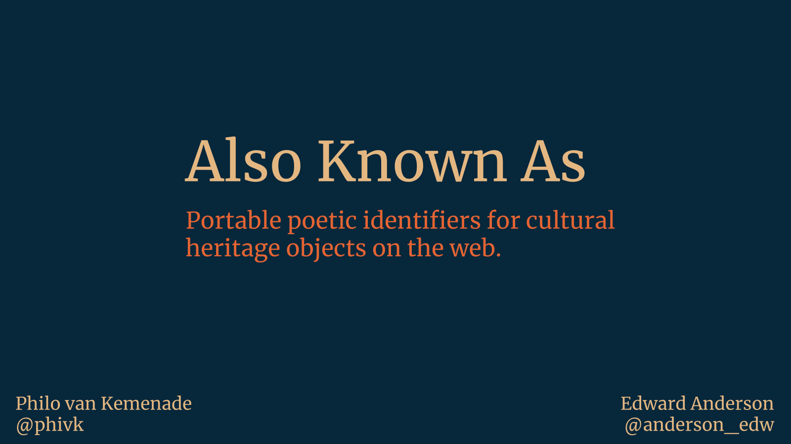

# Also Known As

An experiment for the [Hackathon X vol. 2](https://hackathonx.de/).

Also Known As is an API and browser plug-in for minting portable, poetic names for cultural heritage objects.

[Slides](https://docs.google.com/presentation/d/1lm3K5yOBtm53ZgMWl-_uhwIMzg243u35Xf_2antelTg/edit?usp=sharing).

## Examples:

| Name                               |URL                                                     | Also Known As identifier  | Also Known As URL                                             |
|------------------------------------|--------------------------------------------------------|---------------------------|---------------------------------------------------------|
| Ligula mit Inschrift               | https://katalog.landesmuseum.de/object/OTQvNzEy        | nettes-rundes-silber-ding | https://alsoknownas.glitch.me/nettes-rundes-silber-ding |
| Spuistraat 210 prent: bouwtekening | https://pid.uba.uva.nl/ark:/88238/b1990032751780205131 | gezond-fel-tekening-ding  | https://alsoknownas.glitch.me/gezond-fel-tekening-ding  |
